# Asset Pallet

Download templates: https://sketchfab.com/3d-models/remixable-booth-templates-d565cb7935744d6190b7d23b260e743b
 # booths

|
|

 # booths/opti

| 1 | 2 | 3 | 4 | 5 | 6 |
| --- | --- | --- | --- | --- | --- |
| [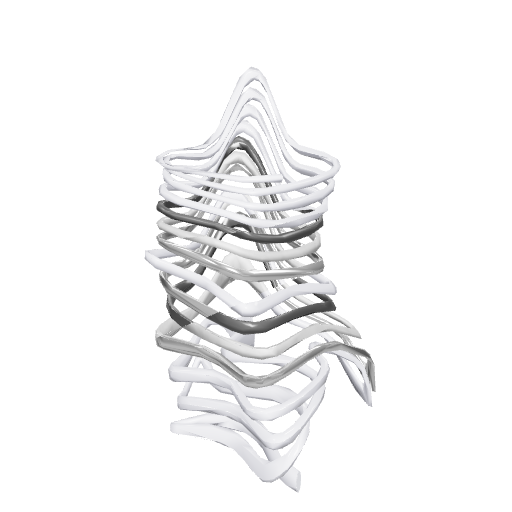](booths/opti/dfw-monoch.glb) | [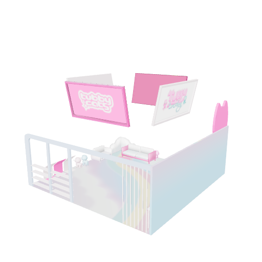](booths/opti/Tubbycats_booth-v2.glb) | [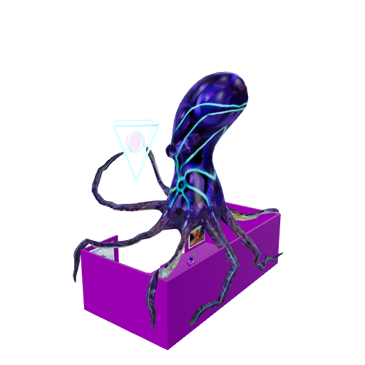](booths/opti/metagame.glb) | [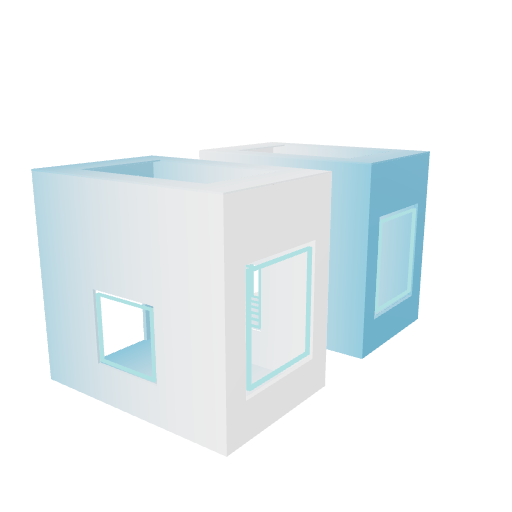](booths/opti/pearlhyacinth_neonboothfinaltwin.glb) | [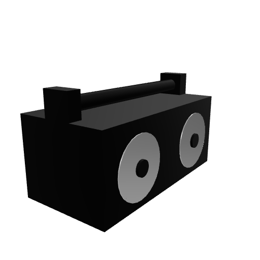](booths/opti/Animated_Boomboxhead2.glb) | [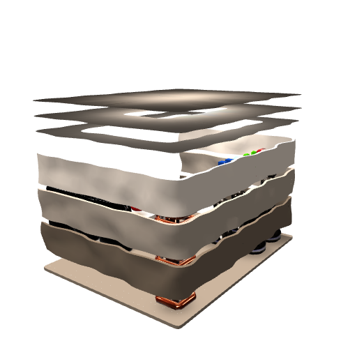](booths/opti/SmoothVoxelsBooth_v2.glb) |
| [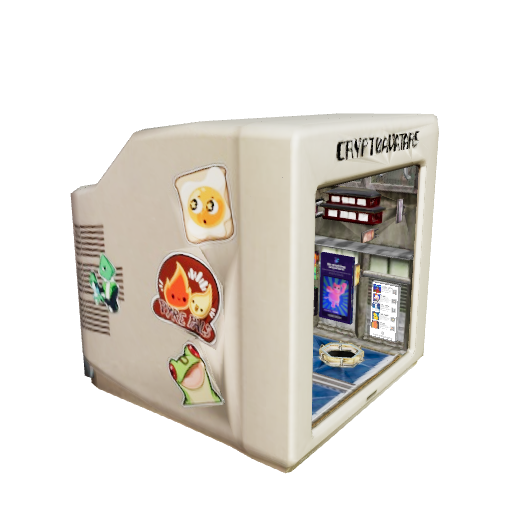](booths/opti/cryptoavatars_Booth.glb) | [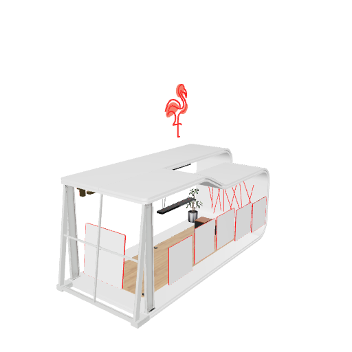](booths/opti/croquet.glb) | [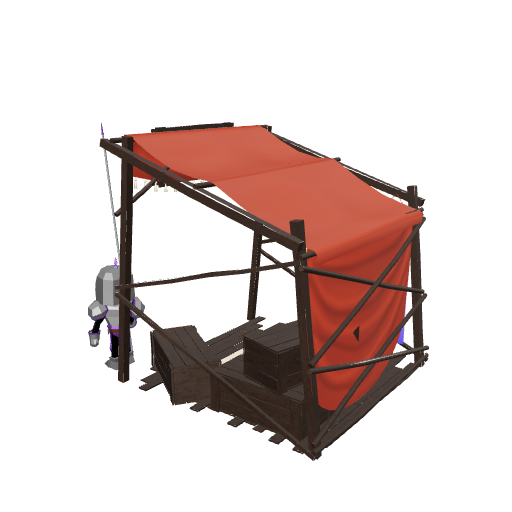](booths/opti/acandar_booth-v1.glb) | [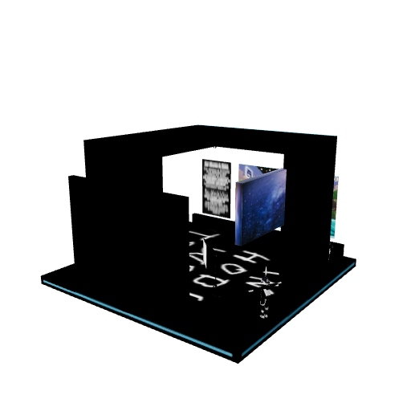](booths/opti/booth_harambe.glb) | [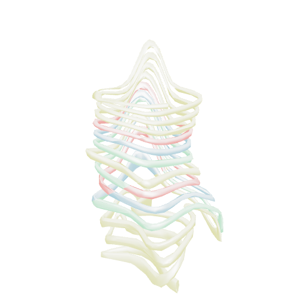](booths/opti/dfw-emy.glb) | [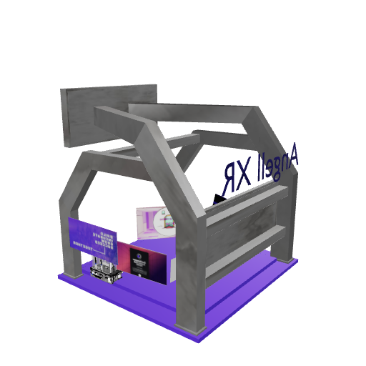](booths/opti/mrmetaverse_booth2.glb) |
| [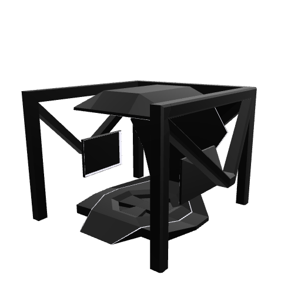](booths/opti/template_booth.glb) | [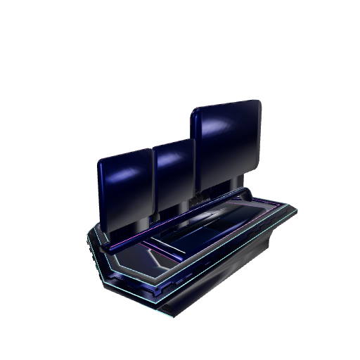](booths/opti/megacube_2_-_booth_bronze.glb) | [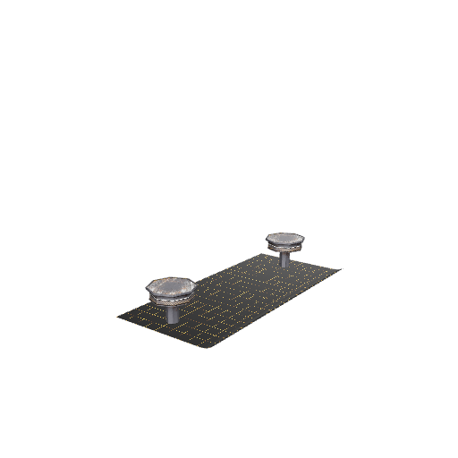](booths/opti/HEAT_Booth2_Final-v2.glb) | [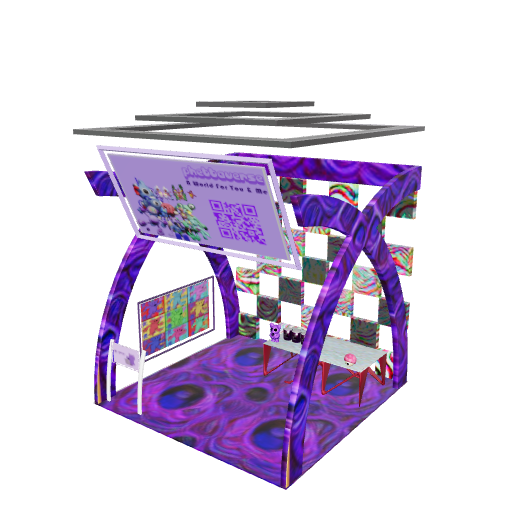](booths/opti/phetta_booth.glb) | [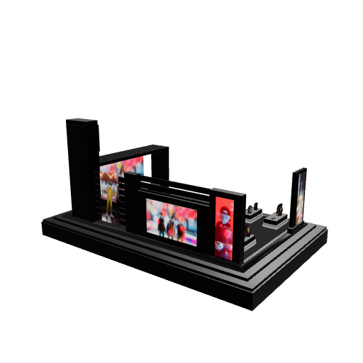](booths/opti/MF_booth-v1.glb) | [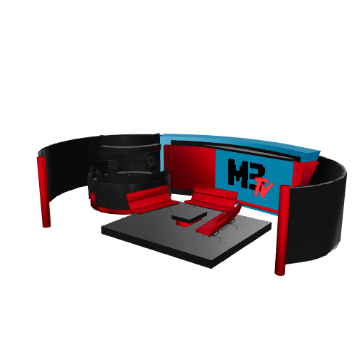](booths/opti/M3TV_stage.glb) |
| [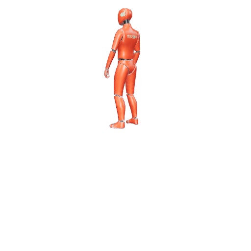](booths/opti/HEAT_t69h_explaining_final.glb) | [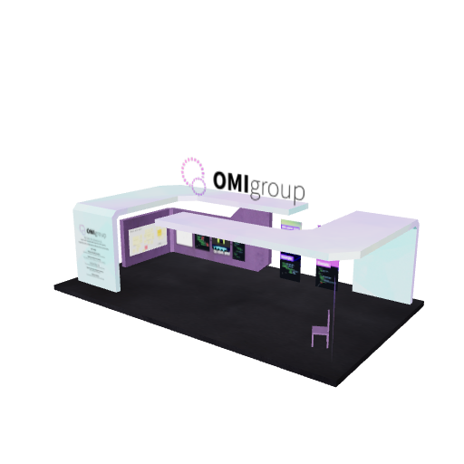](booths/opti/omibooth2_final.glb) | [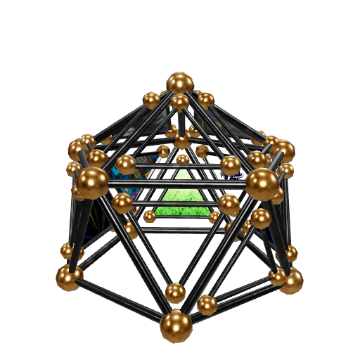](booths/opti/arashi_geobooth.glb) | [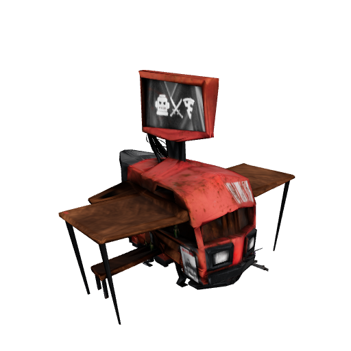](booths/opti/uncannybooth.glb) | [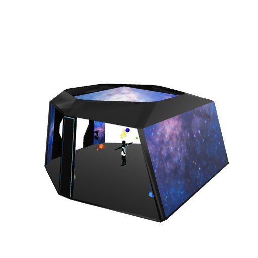](booths/opti/astro_booth.glb) | [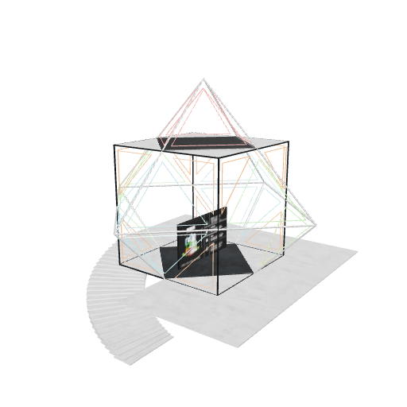](booths/opti/untitledxyz_booth.glb) |
| [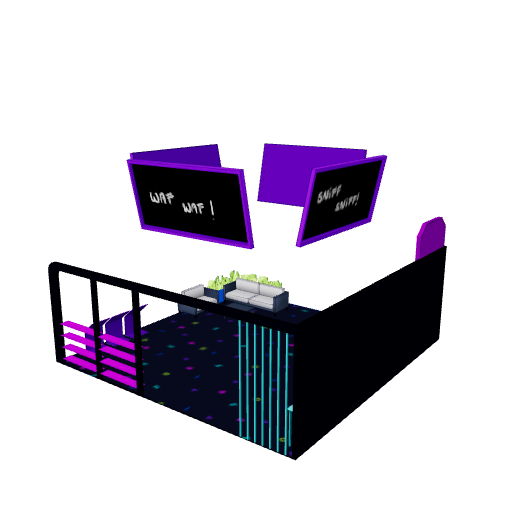](booths/opti/kiiba_booth.glb) | [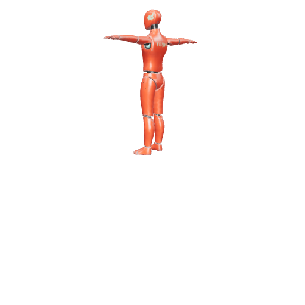](booths/opti/HEAT_t69h_Bop_v2.glb) | [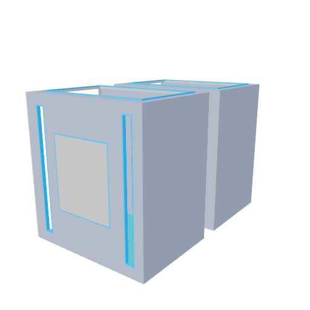](booths/opti/pearl_twinboxbooth.glb) | [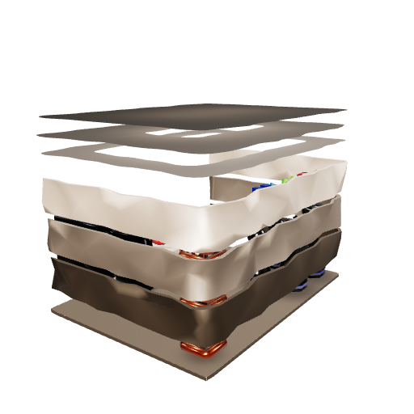](booths/opti/svox_booth.glb) | [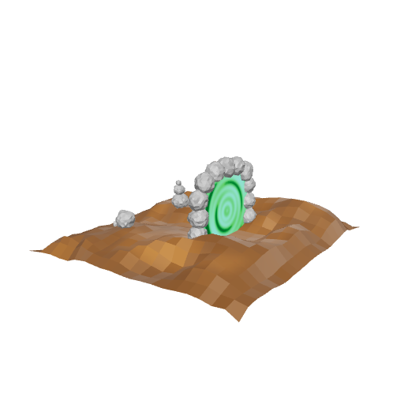](booths/opti/Cairn-Booth-optimized.glb) | [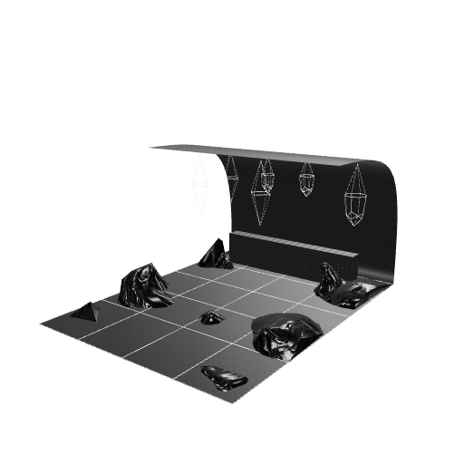](booths/opti/memory_booth.glb) |
|  | [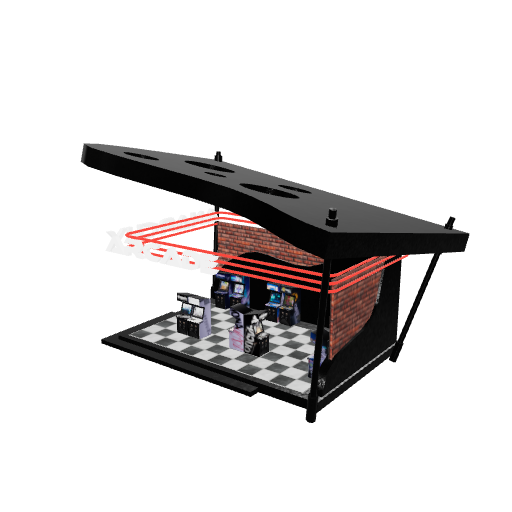](booths/opti/aabooth.glb) | [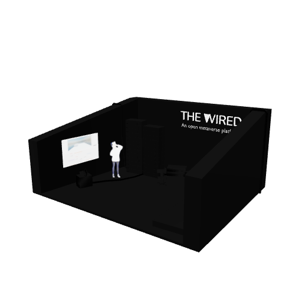](booths/opti/wiredspace.glb) | [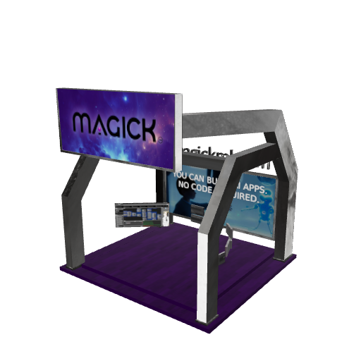](booths/opti/magickbooth.glb) | [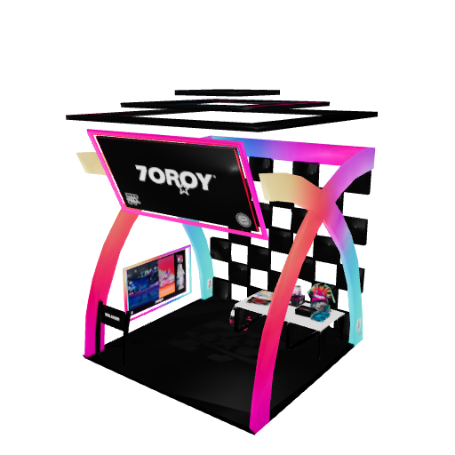](booths/opti/7oroy_BOOTH12.glb) | [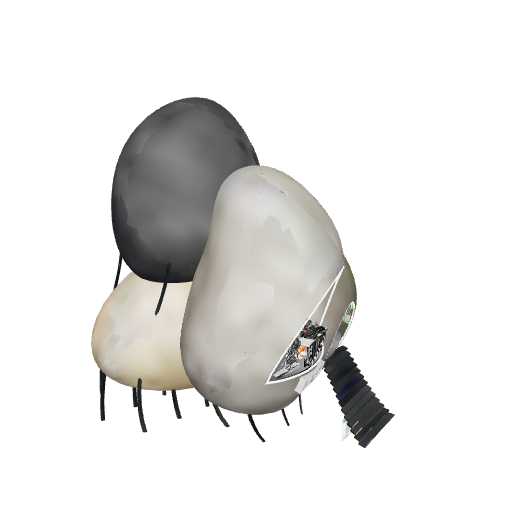](booths/opti/DFWBOOTH.glb) |
| [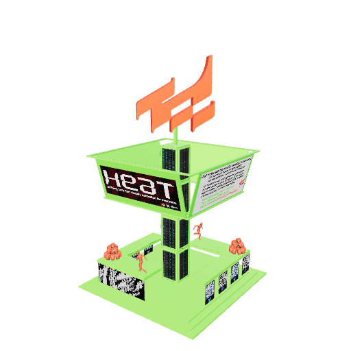](booths/opti/HEAT_Booth1_Final-v1.glb) | [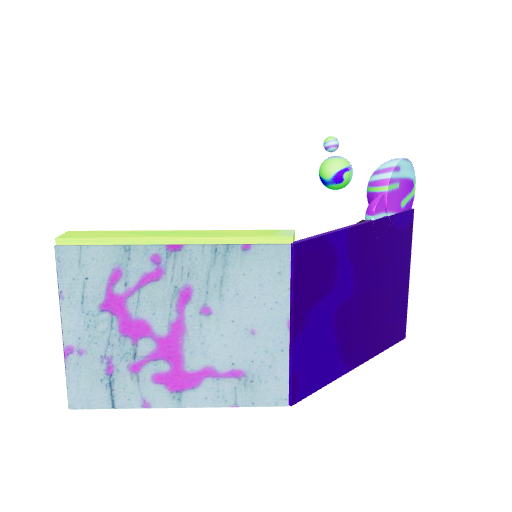](booths/opti/3ov_booth.glb) | [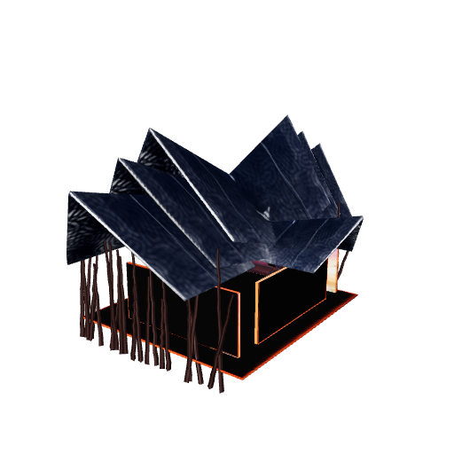](booths/opti/WRG_M3-NeonB-VirtConf_Booth_simplygon.glb) |
 # upload

|
|

